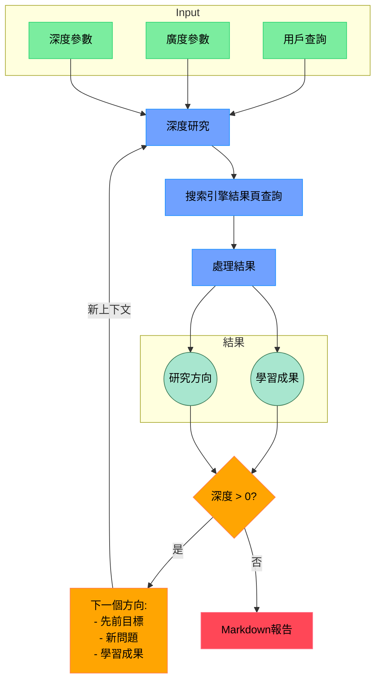

```markdown:/Users/loeb/shandu/README.md
# Shandu：用於全面知識綜合的先進AI研究系統

Shandu是一款前沿的AI研究助手，它利用先進的語言模型、智能網頁抓取和迭代探索，對任何主題進行深入、多源的研究，以生成全面、結構良好且附有恰當引用的報告。

[](LICENSE)
[](https://www.python.org/downloads/)

## 🔍 什麼是Shandu？

Shandu是一個由大型語言模型（LLM）驅動的智能研究系統，它自動化了全面的研究過程，從初始查詢澄清到深入的內容分析和報告生成。它基於LangGraph的基於狀態的工作流程構建，使用精緻的算法進行來源評估、內容提取和知識綜合，遞歸地探索主題。

### 主要使用案例

- **學術研究**：生成文獻綜述、背景信息和複雜主題分析
- **市場情報**：分析行業趨勢、競爭對手策略和市場機會
- **內容創作**：撰寫經過充分研究的文章、博客文章和報告，並附有恰當的引用
- **技術探索**：追蹤新興技術、創新和技術發展
- **政策分析**：研究法規、合規要求和政策影響
- **競爭分析**：跨行業比較產品、服務和公司策略

## ⚙️ Shandu如何工作



## 🌟 主要特性

- **智能的基於狀態的工作流程**：利用LangGraph實現結構化、分步驟的研究過程，具有清晰的狀態轉換
- **迭代式深度探索**：以動態的深度和廣度遞歸地探索主題，適應所發現的信息
- **多源信息綜合**：分析來自搜索引擎、網頁內容和結構化知識庫的數據
- **增強的網頁抓取**：具有動態JavaScript渲染、內容提取和合乎道德的抓取實踐
- **智能來源評估**：自動評估來源的可信度、相關性和信息價值
- **內容分析管道**：使用先進的自然語言處理（NLP）技術提取關鍵信息、識別模式和綜合研究結果
- **全面的報告生成**：創建詳細、結構良好的報告，附有恰當的引用和主題組織
- **並行處理架構**：實現並行操作，以高效地執行多個查詢
- **自適應搜索策略**：根據所發現的信息和知識差距動態調整搜索查詢
- **完整的引用管理**：以多種格式正確引用所有來源

## 🚀 安裝

```bash
# 從PyPI安裝
pip install shandu

# 從源代碼安裝
git clone https://github.com/jolovicdev/shandu.git](https://github.com/loeb-ift/shandu_ZH.git
cd shandu
pip install -e .
```

## 🏁 快速入門

```bash
# 配置API設置（支持各種LLM供應商）
shandu configure

# 運行全面的研究
shandu research "你的研究查詢" --depth 2 --breadth 4 --output report.md

# 通過網頁抓取進行快速的AI搜索（無需Perplexity！）
shandu aisearch "美國現任總統是誰？" --detailed

# 基本的多引擎搜索
shandu search "你的搜索查詢"
```

## 📚 詳細使用方法

### 研究命令

```bash
shandu research "你的研究查詢" \
    --depth 3 \                # 探索的深度（1 - 5，默認值：2）
    --breadth 5 \              # 並行查詢的數量（2 - 10，默認值：4）
    --output report.md \       # 保存到文件而不是終端
    --verbose                  # 顯示詳細的進度信息
```

### 示例報告

你可以在`examples`目錄中找到示例報告：

1. **量子計算、合成生物學和氣候建模的交叉領域**
   ```bash
   shandu research "量子計算、合成生物學和氣候建模的交叉領域" --depth 3 --breadth 3 --output examples/o3-mini-high.md
   ```

### 帶有抓取功能的AI搜索命令

```bash
shandu aisearch "你的搜索查詢" \
    --engines "google,duckduckgo" \  # 以逗號分隔的搜索引擎列表
    --max-results 15 \               # 返回的最大結果數
    --output results.md \            # 保存到文件而不是終端
    --detailed                       # 生成詳細的分析
```

## 💻 Python API

```python
from shandu.agents import ResearchGraph
from langchain_openai import ChatOpenAI

# 如果需要，使用自定義的LLM進行初始化
llm = ChatOpenAI(model="gpt-4")

# 初始化研究圖
researcher = ResearchGraph(
    llm=llm,
    temperature=0.5
)

# 執行深度研究
results = researcher.research_sync(
    query="你的研究查詢",
    depth=3,       # 遞歸研究的深度
    breadth=4,     # 並行探索的查詢數量
    detail_level="high"
)

# 打印或保存結果
print(results.to_markdown())
```

## 🧩 高級架構

Shandu實現了一個複雜的多階段研究管道：

1. **查詢澄清**：通過交互式問題理解研究需求
2. **研究規劃**：制定全面覆蓋主題的戰略計劃
3. **迭代探索**：
   - 基於知識差距生成智能查詢
   - 多引擎搜索，並行執行
   - 搜索結果的相關性過濾
   - 智能網頁抓取，進行內容提取
   - 來源可信度評估
   - 信息分析和綜合
   - 反思研究結果，識別差距
4. **報告生成**：
   - 主題提取和組織
   - 多步驟的報告增強
   - 引用格式和管理
   - 擴展部分內容以實現全面覆蓋

## 🔌 支持的搜索引擎和來源

- Google搜索
- DuckDuckGo
- 維基百科
- ArXiv（學術論文）
- 可以添加自定義搜索引擎

## 📊 技術能力

- **動態JavaScript渲染**：處理大量使用JavaScript的網站
- **內容提取**：識別並提取網頁的主要內容
- **並行處理**：並行執行搜索和抓取操作
- **緩存**：高效緩存搜索結果和抓取的內容
- **速率限制**：尊重對網絡資源的訪問權限
- **Robots.txt合規**：合乎道德的網頁抓取實踐
- **靈活的輸出格式**：Markdown、JSON、純文本

## 📜 許可協議與信息
注意：這只是一個想法，我需要貢獻者，這是一個我深入研究LangChain和LangGraph的項目！
本項目遵循MIT許可協議 - 詳情請參見[LICENSE](LICENSE)文件。
```

以上就是完整轉換為繁體中文後的 `README.md` 文件內容。 
